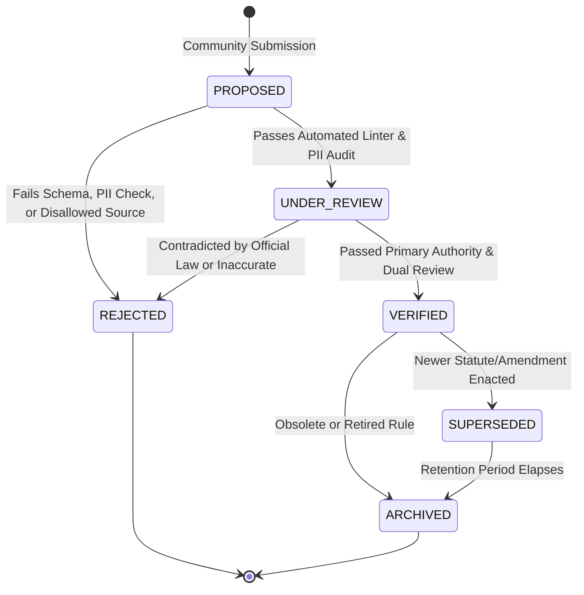

# Legal-GPT Community Verification Workflow

This document defines the formal lifecycle and verification pipeline through which community submissions transition from unverified proposals to certified authoritative components of Legal-GPT.

---

## 1. The 6 Lifecycle States



### State Definitions

1. **`PROPOSED`**: The initial intake state.
   - The submission is received, assigned a unique `CONTRIB-ID`, and placed in an **isolated staging quarantine**.
   - **Quarantine Guarantee**: `PROPOSED` items are invisible to the core legal reasoning engine and cannot be returned to users as authoritative law.
2. **`UNDER_REVIEW`**: Active automated and human audit state.
   - Triggered when the submission satisfies structural schema checks and passes automated security/PII scans.
   - Assigned to automated legal checkers and human reviewers.
3. **`VERIFIED`**: Certified authoritative state.
   - The submission has been authenticated against primary official government/court records, verified for temporal currency, and signed off by a qualified legal reviewer.
   - **Only `VERIFIED` items are promoted to the live authoritative legal registry.**
4. **`REJECTED`**: Permanently declined state.
   - Assigned when a submission contains private case data, cites fabricated or overruled authority, originates from unverified blogs/forums, or fails verification.
5. **`SUPERSEDED`**: Replaced by subsequent authority.
   - Assigned when a previously verified statute, regulation, or court rule is amended, repealed, or overruled by a newer enactment. Links to the successor `CONTRIB-ID`.
6. **`ARCHIVED`**: Historical preservation state.
   - Preserved for point-in-time historical legal evaluation (e.g. evaluating what law governed on a date in 2018), but marked inactive for current prospective advice.

---

## 2. Multi-Stage Verification Pipeline

Every contribution must clear **4 sequential verification gates**:

### Gate 1: Automated Ingestion & Privacy Firewall
- **Schema Validation**: Validates all 9 mandatory fields against [SOURCE_SUBMISSION_SCHEMA.md](SOURCE_SUBMISSION_SCHEMA.md).
- **Deep PII Audit**: Automated regex and heuristic scans for Social Security Numbers, names of private minor children, private docket numbers, and local machine profile paths.
- **License Check**: Rejects any non-permissive or commercial copyright declarations.

### Gate 2: Source Priority & Official Domain Authentication
- Evaluates the submission's `provenance.origin_url` against the `SourcePriorityRanker` rules:
  - **Preferred**: Primary official portals (`.gov`, `.courts.gov`, official legislative portals, eCFR, SCOTUS slip opinions).
  - **Prohibited**: Unverified legal blogs, forums (Reddit, Quora), and AI-generated synthetic material.
- Verifies SHA-256 content hashes to guarantee the submission matches the official source text.

### Gate 3: Epistemic & Citator Verification
- **Citation Verification**: Passes through `CitationVerifier` to ensure standardized citation syntax (e.g. Bluebook / Washington Style Sheet).
- **Relational Citator Check**: Evaluates the citation against `LegalCitatorGraph`. If the authority is marked `NEGATIVE` (Overruled, Abrogated, Struck Down), the submission is flagged or rejected.
- **Point-in-Time Temporal Check**: Evaluates statutory effective dates with `TemporalGraphEngine` to ensure the effective date accurately reflects the enacted bill.

### Gate 4: Human Review & Audit Certification
- **Community Reviewer**: Cross-checks factual claims and statutory formatting.
- **Qualified Legal Reviewer**: Verifies that the plain-English summary, relevant text, or benchmark questions do not misstate governing legal doctrine.
- **Cryptographic Sign-Off**: The reviewer logs an immutable audit entry in the provenance ledger.

---

## 3. Strict Firewall Guarantee

```
[COMMUNITY SUBMISSION]
       │
       ▼
┌────────────────────────────────────────┐
│     QUARANTINE STAGING LAYER           │
│   (PROPOSED / UNDER_REVIEW)            │
│  - Stored in staging/contributions     │
│  - CANNOT be queried by LegalGPT API   │
│  - CANNOT cite as authoritative law    │
└──────────────────┬─────────────────────┘
                   │
         Passes Verification Gates
                   │
                   ▼
┌────────────────────────────────────────┐
│     LIVE AUTHORITATIVE REGISTRY        │
│          (VERIFIED ONLY)               │
│  - Integrated into legal_registry      │
│  - Linked into Citator Knowledge Graph │
│  - Live in Production Reasoning        │
└────────────────────────────────────────┘
```
