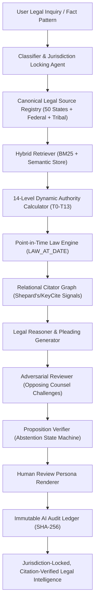
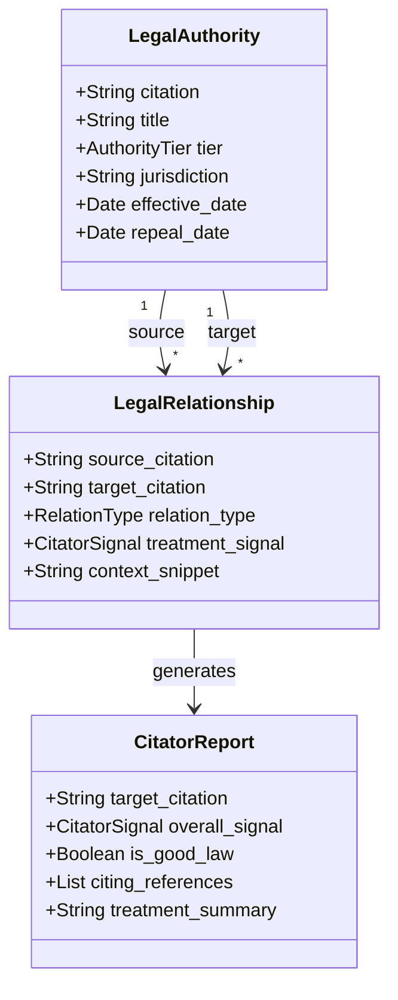
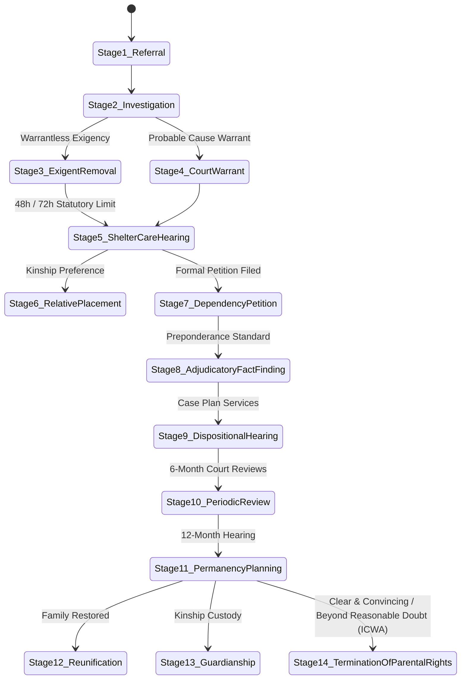

# Legal-GPT: System Architecture & Design Specification

This document provides a comprehensive technical breakdown of the architecture, data structures, multi-agent pipeline, citator graph, and verification engines powering **Legal-GPT**.

---

## 🏛️ 1. Multi-Agent Reasoning & Verification Pipeline

---

## ⚖️ 2. 14-Level Dynamic Authority Hierarchy (T0–T13)

The authority calculator calculates composite legal weights dynamically using the formula:
$$\text{AuthorityWeight} = \text{CourtLevel} + \text{JurisdictionMatch} + \text{BindingStatus} + \text{TemporalValidity} + \text{ProceduralPosture} + \text{CitationTreatment}$$

| Tier | Level Name | Authority Classification | Example Authorities | Default Base Weight |
|---|---|---|---|---|
| **T0** | `CONSTITUTION_FEDERAL` | U.S. Constitution & Supreme Precedent | U.S. Const. Art. I, 14th Amend., *Santosky*, *Troxel* | **1.00** |
| **T1** | `FEDERAL_STATUTE` | U.S. Code Primary Statutes | 25 U.S.C. (ICWA), 42 U.S.C. (Title IV-E) | **0.95** |
| **T2** | `FEDERAL_REGULATION` | Code of Federal Regulations | 25 C.F.R. Part 23, 45 C.F.R. | **0.90** |
| **T3** | `SCOTUS_PRECEDENT` | U.S. Supreme Court Precedents | *Haaland v. Brackeen*, *Lassiter v. DSS* | **0.92** |
| **T4** | `FEDERAL_CIRCUIT_PRECEDENT` | U.S. Courts of Appeals (1st–11th, D.C., Fed Cir) | 9th Circuit, 7th Circuit, 5th Circuit | **0.85** |
| **T5** | `FEDERAL_DISTRICT_PRECEDENT` | U.S. District & Bankruptcy Courts | W.D. Wash., N.D. Ill., S.D. Tex. | **0.75** |
| **T6** | `STATE_CONSTITUTION` | State Fundamental Constitutions | Wash. Const. Art. I, Ill. Const. | **0.90** |
| **T7** | `STATE_PRIMARY_STATUTE` | State Enacted Statutes | RCW 13.34, 705 ILCS 405, ORC § 2151 | **0.88** |
| **T8** | `STATE_ADMINISTRATIVE_CODE` | State Administrative Regulations | WAC Title 110, 89 Ill. Adm. Code | **0.80** |
| **T9** | `STATE_SUPREME_PRECEDENT` | State Highest Appellate Court Precedents | *In re Dependency of K.N.J.*, *In re Arthur H.* | **0.82** |
| **T10** | `STATE_APPELLATE_PRECEDENT` | State Intermediate Courts of Appeals | WA Court of Appeals (Div I-III), IL App. Ct. | **0.78** |
| **T11** | `STATE_COURT_RULES` | Governing Rules of Court | Wash. JuCR, Ill. S. Ct. Rules, Cal. CRC | **0.75** |
| **T12** | `AGENCY_POLICY_MANUAL` | Official State Child Welfare Policy Manuals | DCYF Practice Guide, DCFS Procedures 300 | **0.65** |
| **T13** | `SECONDARY_PERSUASIVE` | Treatises, Restatements, Law Reviews | Restatement of the Law, Model Rules | **0.50** |

---

## 🔁 3. Relational Knowledge Graph & Citator Engine

### Citator Treatment Signals
- **`GOOD_LAW`** (Positive): Precedent has been affirmed, followed, or interpreted favorably by controlling appellate courts.
- **`CAUTION`** (Cautionary): Precedent has been distinguished on its facts or criticized in subsequent decisions.
- **`NEGATIVE`** (Negative): Precedent has been expressly overruled, abrogated, or superseded by legislative enactment.
- **`NEUTRAL`** (Informational): Background historical reference or neutral statutory citation.

---

## 👶 4. 14-Stage Child Welfare (CPS) Legal Lifecycle

---

## 🤖 5. Local AI Server & Model Context Protocol (MCP) Integration

Legal-GPT operates as a standard JSON-RPC 2.0 **Model Context Protocol (MCP)** server, enabling tool integration with:
- **LM Studio**
- **OpenWebUI**
- **Claude Desktop**
- **Ollama / vLLM Local Clusters**

### Available MCP Tools
1. `legal_query`: Jurisdiction-locked legal reasoning with temporal analysis and citation verification.
2. `citator_lookup`: Inspects subsequent treatment signals and citing precedents.
3. `law_at_date`: Evaluates point-in-time statutory revisions or computes line-by-line diffs.
4. `due_process_audit`: Evaluates 7 constitutional due process pillars.
5. `evaluate_evidence`: Separates unverified allegations from documented exhibits and spots proof gaps.
6. `generate_pleading`: Generates state-specific court motion captions and arguments.
7. `verify_citation`: Authenticates legal citations against canonical registries.
