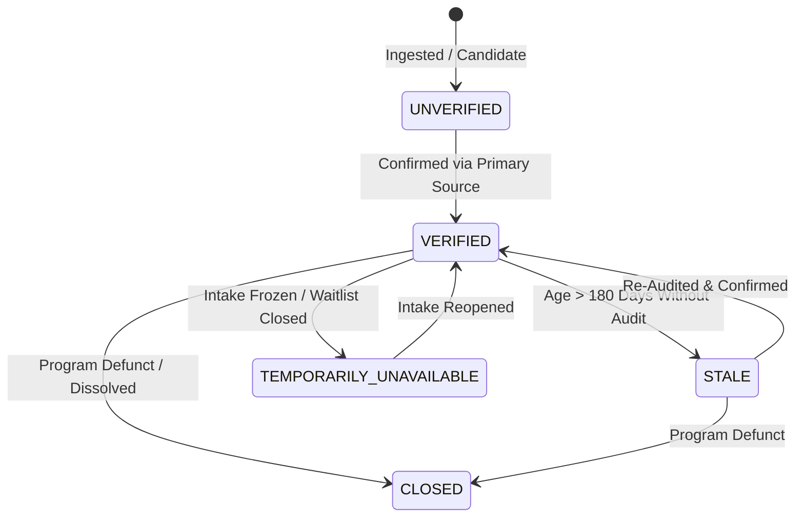

# Legal-GPT Public Resource Data Policy & Verification Standard

**Version:** 1.0.0  
**Effective Date:** 2024-08-01  
**Authority:** Legal-GPT Data Governance & Public Infrastructure Board  
**Scope:** All public legal aid, court self-help, public defense, advocacy, and social service directories within Legal-GPT.

---

## 1. Executive Summary & Non-Negotiable Core Mandate

The mission of Legal-GPT is to provide reliable, educational public legal infrastructure to ordinary individuals navigating legal proceedings. 

> [!CAUTION]
> ### THE ZERO-INVENTION RULE
> **Legal-GPT strictly prohibits generating synthetic, speculative, or hallucinated public service resources.**
> Under no circumstances may an organization name, telephone number, website, physical address, intake eligibility criterion, office location, or offered service be invented.
> 
> If a resource cannot be affirmatively grounded in and verified against official primary sources, the system **must** classify it as `UNVERIFIED` and suppress it from public recommendations.

---

## 2. Taxonomy of 18 Canonical Organization Types

All public resources within `legal_registry/resources/` must be categorized into one of the following 18 defined types:

1. **`LEGAL_AID`**: Non-profit, LSC-funded, or IOLTA-supported civil legal aid organizations providing free direct representation and advice to low-income individuals.
2. **`COURT_SELF_HELP`**: Official courthouse facilitator offices, self-represented litigant help desks, and judicial council self-help portals.
3. **`PUBLIC_DEFENDER`**: State, county, or institutional indigent defense organizations providing court-appointed representation in criminal, juvenile delinquency, or child dependency matters.
4. **`BAR_REFERRAL`**: State or county bar association lawyer referral services and moderate-means panels offering reduced-fee consultations.
5. **`CIVIL_RIGHTS_ORGANIZATIONS`**: Non-profit legal defense organizations specializing in constitutional liberties, impact litigation, and anti-discrimination advocacy (e.g., ACLU, NAACP LDF).
6. **`CHILD_ADVOCACY`**: Independent organizations, CASAs (Court Appointed Special Advocates), and guardian ad litem offices representing the best interests and rights of children.
7. **`DOMESTIC_VIOLENCE_SERVICES`**: Confidential crisis shelters, 24/7 hotlines, safety planning programs, and civil protection order clinics.
8. **`DISABILITY_SERVICES`**: Federally designated Protection & Advocacy (P&A) agencies and specialized disability rights centers enforcing ADA Title II and related statutes.
9. **`MENTAL_HEALTH_SERVICES`**: Public mental health authorities, 988 crisis lines, and behavioral health treatment referral clearinghouses.
10. **`SUBSTANCE_USE_SERVICES`**: Licensed public recovery centers, state helplines, detoxification locators, and harm reduction programs.
11. **`HOUSING_SERVICES`**: Tenant unions, fair housing centers, HUD-certified housing counseling agencies, and eviction prevention networks.
12. **`EDUCATION_ADVOCACY`**: Independent education ombuds, special education (IEP/504) clinics, and student rights defense organizations.
13. **`VETERANS_SERVICES`**: VA-recognized Veterans Service Organizations (VSOs) and specialized legal clinics assisting with military discharge upgrades and disability appeals.
14. **`TRIBAL_SERVICES`**: Sovereign tribal court clerk offices, tribal ICWA designated agents, and tribal children's social services.
15. **`IMMIGRATION_SERVICES`**: DOJ Executive Office for Immigration Review (EOIR) recognized organizations and non-profit legal defense projects.
16. **`MEDIATION`**: Non-profit community dispute resolution centers (CDRCs) offering voluntary mediation for family, parenting plan, or landlord-tenant disputes.
17. **`OMBUDS`**: Statutorily established independent state ombudsman offices investigating administrative complaints against government agencies (e.g., child welfare ombuds).
18. **`GOVERNMENT_AGENCIES`**: Official federal, state, or county administrative oversight agencies (e.g., HHS ACF Children's Bureau, state child welfare headquarters).

---

## 3. Resource Lifecycle States

Every resource record maintains an audited lifecycle state in `ResourceState`:

1. **`VERIFIED`**: The resource's identity, contact information, eligibility, and service scope have been affirmatively validated against an approved primary authority within the preceding **180 days**.
2. **`STALE`**: The resource was previously verified, but more than 180 days have elapsed since the last audit. Stale records are deprioritized by the ranking engine until re-verified.
3. **`UNVERIFIED`**: Sourcing is incomplete, ungrounded, or failed automated format checks. Unverified resources are **strictly excluded** from ordinary public search queries.
4. **`CLOSED`**: The organization or program has permanently ceased operations or disbanded. Never shown to users.
5. **`TEMPORARILY_UNAVAILABLE`**: The organization is active, but currently operating under an intake freeze, closed waitlist, or seasonal pause. Suppressed by default unless explicitly requested.

---

## 4. Primary Verification Sources & Standards

To achieve `VERIFIED` status, a record must be grounded in an authoritative primary source:

- **Government Entities & Courts**: Must resolve to an official `.gov`, `.mil`, or `.us` domain, or appear in the official state legislative or executive manual.
- **Legal Aid Programs**: Must be indexed in the **Legal Services Corporation (LSC)** official grantee database, the relevant state Supreme Court IOLTA roster, or state legal aid network.
- **Bar Referral Services**: Must appear on the official public roster of a recognized State Bar Association or ABA-accredited local bar association.
- **Immigration Legal Services**: Must be recognized by the **U.S. Department of Justice Executive Office for Immigration Review (EOIR)**.
- **Tribal Services**: Must be confirmed in the **Bureau of Indian Affairs (BIA)** designated ICWA agent listing published in the Federal Register.
- **Telephone Numbers**: Must pass canonical North American E.164 formatting. Dummy numbers (such as `555-01xx` or zeroed area codes) cause immediate rejection.

---

## 5. Audit Cadence & Automated Governance

1. **Continuous Automated Health Checks**: Automated crawlers verify HTTP response codes (200 OK) for official URLs on a monthly cycle.
2. **Quarterly Comprehensive Audit (90 Days)**: Resource records are re-audited against primary registries every 90 days.
3. **Hard Staleness Threshold (180 Days)**: Any resource with `(date.today() - last_verified).days > 180` automatically transitions to `STALE`.
4. **Immediate De-Listing**: If an organization undergoes an intake freeze, leadership transition, or contact change, its state is updated immediately in `legal_registry/resources/resource_registry.py`.

---

## 6. Community Corrections & Transparency

Legal aid practitioners, court clerks, and public users can report outdated contact details, broken intake links, or defunct services through the project issue tracker. All proposed updates must cite an official government or organization URL before ingestion.
