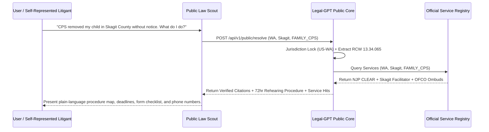

# Public Scout Bridge Specification & Legal-GPT Contract

## 1. Architectural Overview & Hard Wall Isolation

The **Legal-GPT Public Bridge** provides an authoritative, zero-hallucination statutory resolution and official civil services routing interface for autonomous legal agents, public legal scout interfaces, and self-represented litigants.

```
┌─────────────────────────────────────────────────────────────┐
│                 Public Law Scout Interface                  │
│       (Symbolic Fact Patterns, No Case Files, Zero PII)      │
└──────────────────────────────┬──────────────────────────────┘
                               │
            HTTPS REST API / MCP Tool Protocol
                               │
                               ▼
┌─────────────────────────────────────────────────────────────┐
│                   Legal-GPT Public Core                     │
│  - Strict Jurisdiction Locking (50 States + Federal)        │
│  - Anti-Hallucination Citation Verification (Tier 0 / 1)    │
│  - Point-in-Time Statutory Graph (LAW_AT_DATE)              │
│  - Official Civil Services Registry (WA, IL, OH, Federal)   │
│  - Explicit Abstention Protocol                             │
└─────────────────────────────────────────────────────────────┘
```

### Strict Isolation Rules (PUBLIC_DATA_POLICY.md)
- **Zero Case Vault Access**: The public API never interacts with private case directories, voiceprints, audio transcripts, or local evidentiary stores.
- **Symbolic Party Placeholders**: All inquiries must utilize symbolic abstractions (e.g. `[RESPONDENT_PARENT]`, `[CHILD_INITIALS]`, `[PROPOSED_KINSHIP_PLACEMENT]`).
- **No Ungrounded Completions**: If governing primary authority is missing or fails verification, the engine must return `abstention_state: "ABSTAIN"`.
- **Advisory Only**: Output is strictly educational and legal research intelligence; it never provides formal legal advice or creates an attorney-client relationship.

---

## 2. Public REST API Endpoints

### A. Primary Legal Resolution (`POST /api/v1/public/resolve`)
Resolves a legal question or procedural topic with verified controlling statutory citations, practical procedural options, and relevant civil service provider contacts.

#### Request Schema
```json
{
  "question": "What is the mandatory shelter care hearing deadline after child removal in Washington?",
  "jurisdiction": "WA",
  "county": "Skagit",
  "date": "2024-01-01",
  "matter": "FAMILY_CPS"
}
```

#### Response Schema
```json
{
  "jurisdiction_lock": "WA (State) / Skagit County",
  "matter": "FAMILY_CPS",
  "controlling_sources": [
    "RCW 13.34.065"
  ],
  "verified_citations": [
    {
      "raw_citation": "RCW 13.34.065",
      "normalized_citation": "RCW 13.34.065",
      "verified": true,
      "authority_tier": "TIER_0",
      "publisher_name": "Washington State Legislature",
      "jurisdiction": "US-WA",
      "source_url": "https://app.leg.wa.gov/rcw/default.aspx?cite=13.34.065"
    }
  ],
  "procedure_options": [
    {
      "title": "Affidavit for Rehearing of Shelter Care Order & Motion for Immediate Return",
      "governing_statute_or_rule": "RCW 13.34.065(1)(b) & JuCR 2.4",
      "deadline": "Within 72 hours of filing parent affidavit",
      "filing_steps": [
        "Obtain court-approved Form WPF JU 02.0200 (Motion and Declaration for Rehearing)",
        "Attach Parent Affidavit establishing lack of notice or new evidence",
        "File with County Superior Court Clerk Juvenile Division",
        "Serve DCYF Assistant Attorney General and Child's Counsel within 24 hours"
      ],
      "required_forms": [
        "Form WPF JU 02.0200",
        "Proposed In-Home Safety Plan"
      ],
      "service_requirements": "Personal service on AAG and Child CASA/Attorney within 24 hours"
    }
  ],
  "service_hits": [
    {
      "service_id": "WA-SERV-SKAGIT-FACILITATOR",
      "name": "Skagit County Superior Court Family Law Facilitator",
      "service_type": "COURT_SELF_HELP",
      "contact": {
        "phone": "360-416-1200",
        "website": "https://www.skagitcounty.net/Departments/SuperiorCourt",
        "address": "205 W. Kincaid St., Room 202, Mount Vernon, WA 98273"
      },
      "eligibility_summary": "Self-represented litigants filing in Skagit County Superior Court."
    },
    {
      "service_id": "WA-SERV-NJP-CLEAR",
      "name": "Northwest Justice Project (NJP) / CLEAR Hotline",
      "service_type": "LEGAL_AID",
      "contact": {
        "phone": "1-888-201-1014",
        "website": "https://nwjustice.org"
      },
      "eligibility_summary": "Income under 200% Federal Poverty Level in Washington State."
    }
  ],
  "abstention_state": "ANSWERED",
  "abstention_reason": null,
  "short_answer": "Under WA law, a shelter care hearing must be held within 72 hours of removal (excluding weekends and holidays).",
  "analysis": "RCW 13.34.065 requires that when a child is taken into custody...",
  "disclaimer": "IMPORTANT LEGAL DISCLAIMER: This information is provided for legal research and educational purposes only..."
}
```

---

### B. Civil Services Directory Query (`GET /api/v1/public/services`)
Queries verified official institutional support directories across states and counties.

#### Query Parameters
- `state`: 2-letter state code (e.g. `WA`, `IL`, `OH`).
- `county`: Optional county name (e.g. `Skagit`, `Cook`, `Cuyahoga`).
- `matter`: Civil matter taxonomy filter (`FAMILY_CPS`, `HOUSING`, `CONSUMER_DEBT`, `EMPLOYMENT`, `BENEFITS`, `EDUCATION`, `DISABILITY`, `IMMIGRATION`, `SMALL_CLAIMS`, `PUBLIC_RECORDS`).
- `service_type`: Service category (`LEGAL_AID`, `COURT_SELF_HELP`, `BAR_REFERRAL`, `AG_CONSUMER`, `TRIBAL_ICWA`, `PUBLIC_CONTACT`).

#### Example Request
```http
GET /api/v1/public/services?state=WA&county=Skagit&matter=FAMILY_CPS
```

### E. Progressive Legal Literacy (`POST /api/v1/public/explain-concept`)
Explains complex legal concepts across five progressive literacy levels (Plain English, Practical, Terminology, Primary Authority, Advanced Analysis) with verification-gated authority and five on-demand drill-down actions (`SHOW_SOURCE`, `SHOW_STATUTE`, `SHOW_CASE`, `EXPLAIN_OPPOSING`, `SHOW_TEMPORAL_CHANGE`).

#### Request Schema
```json
{
  "concept": "due_process",
  "state": "WA",
  "level": 1,
  "situation": "CPS emergency removal investigation",
  "drill_down": "SHOW_STATUTE"
}
```

#### Response Schema
```json
{
  "concept": "Due Process of Law",
  "jurisdiction": "WA",
  "disclaimer": "Legal information only. Not legal advice. Not a lawyer.",
  "requested_level_text": "The basic idea is that government officials cannot simply take away your freedom, your children, or your property on their own whim...",
  "available_levels": [1, 2, 3, 4, 5],
  "verification_status": "VERIFIED",
  "citations": [
    "U.S. Const. amend. XIV, § 1",
    "Mathews v. Eldridge, 424 U.S. 319 (1976)",
    "Santosky v. Kramer, 455 U.S. 745 (1982)",
    "Wash. Const. art. I, § 3",
    "RCW 13.34.065"
  ],
  "drill_down_actions": [
    "SHOW_SOURCE",
    "SHOW_STATUTE",
    "SHOW_CASE",
    "EXPLAIN_OPPOSING",
    "SHOW_TEMPORAL_CHANGE"
  ],
  "abstention_reason": null,
  "drill_down_result": {
    "action": "SHOW_STATUTE",
    "title": "Controlling Statutory Frameworks Governing Due Process Timelines",
    "content": "Under Washington law, RCW 13.34.065 requires a shelter care hearing within 72 hours of emergency custody excluding weekends and holidays...",
    "citations": ["RCW 13.34.065", "42 U.S.C. § 671"],
    "official_sources": [
      "https://app.leg.wa.gov/rcw/default.aspx?cite=13.34.065",
      "https://uscode.house.gov/"
    ]
  }
}
```

#### CLI Equivalent
```bash
legal-gpt explain-concept --concept due_process --state WA --level 1
legal-gpt explain-concept --concept emergency_removal --state WA --drill-down SHOW_STATUTE --json
```

---

## 3. Civil Matter Taxonomy

| Taxonomy Key | Matter Scope | Example Remedies & Processes |
|:---|:---|:---|
| `FAMILY_CPS` | Child Welfare, Shelter Care, Dependency, Custody, Protective Orders | 72-hr Rehearing Affidavits, Kinship Placement Motions |
| `HOUSING` | Evictions, Habitability, Unlawful Detainer, Tenant Rights | Pay or Vacate Answers, Repair Request Notices |
| `CONSUMER_DEBT` | Debt Defense, FDCPA, Predatory Lending, Auto Repossession | Debt Validation Letters, Cease & Desist Notices |
| `EMPLOYMENT` | Wage Theft, Worker Misclassification, Unpaid Overtime | State Labor Board Wage Claims |
| `BENEFITS` | SNAP, Medicaid Denial, TANF, SSI/SSDI Disability Hearings | Administrative Hearing Requests, Redetermination Appeals |
| `EDUCATION` | Special Education, IEP Enforcement, Disciplinary Expulsions | Due Process Hearing Requests, Manifestation Determinations |
| `DISABILITY` | ADA Title II/III Accommodations, Barrier Removal | Administrative ADA Grievance Filings |
| `IMMIGRATION` | Public Process, Naturalization Forms, Fee Waivers | Form N-400 Info, USCIS Public Intake |
| `SMALL_CLAIMS` | Monetary Disputes, Security Deposit Return, Breach of Contract | Small Claims Notice of Claim & Summons |
| `PUBLIC_RECORDS` | State Public Records Acts, FOIA Inquiries, Sunshine Laws | Formal Public Records Requests & Exemption Appeals |

---

## 4. Model Context Protocol (MCP) Tools

Public AI agents interacting via MCP JSON-RPC have access to two core tools:

1. **`lookup_public_law`**:
   - Executes jurisdiction-locked research against official statutory and precedent corpuses.
   - Evaluates point-in-time validity (`LAW_AT_DATE`) and generates verified citations.

2. **`lookup_services`**:
   - Looks up verified legal aid organizations, court self-help desks, bar referral lines, and public agency ombuds offices.

---

## 5. Public Scout Usage Workflow


